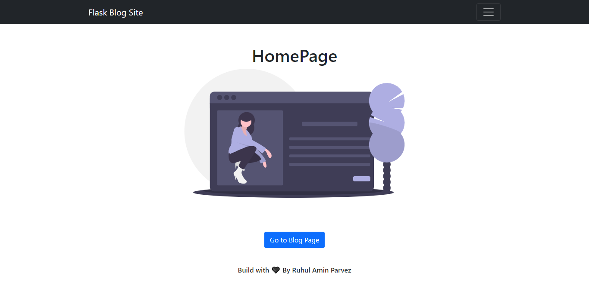
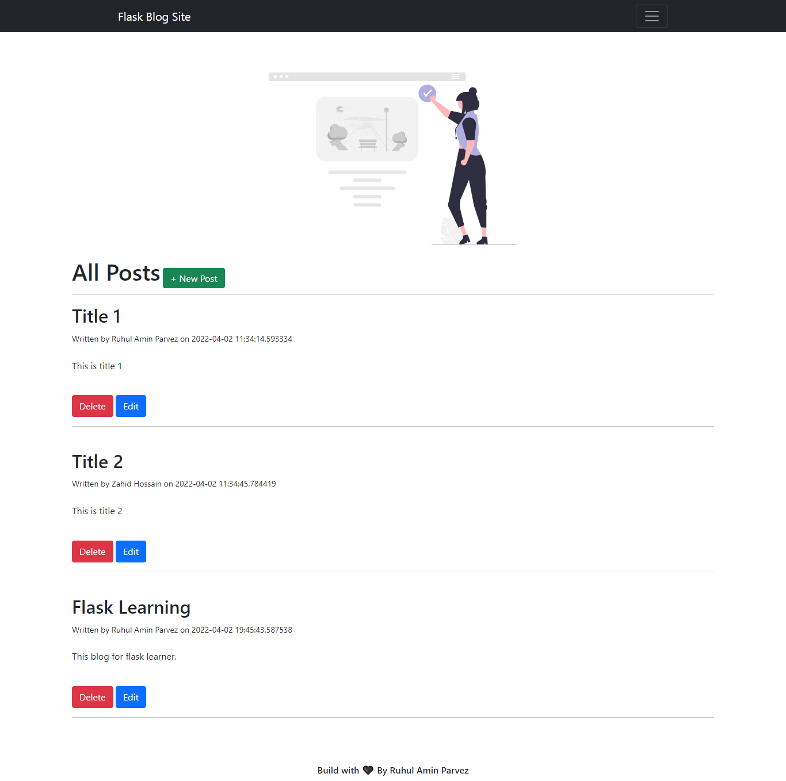
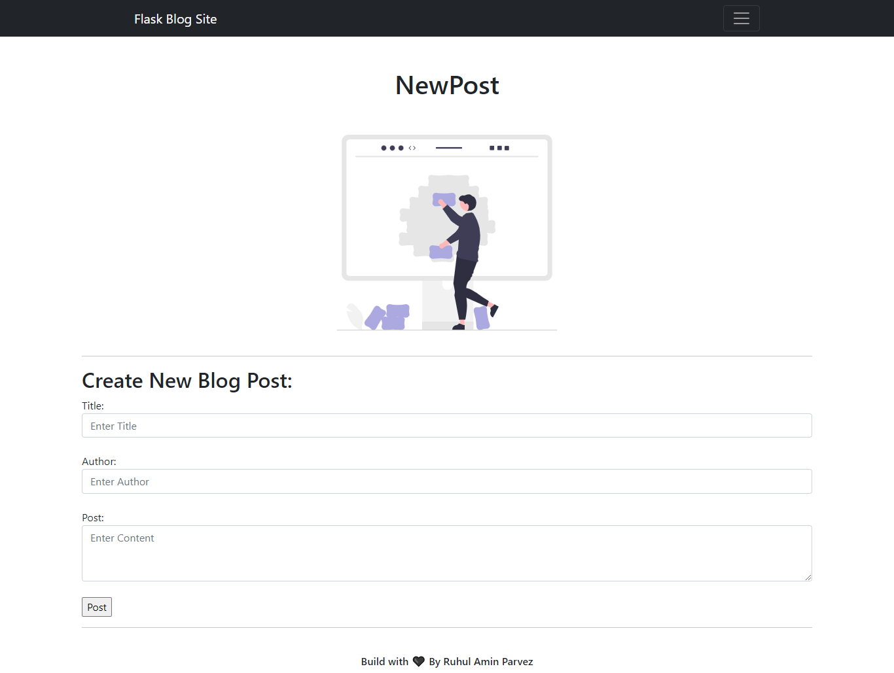
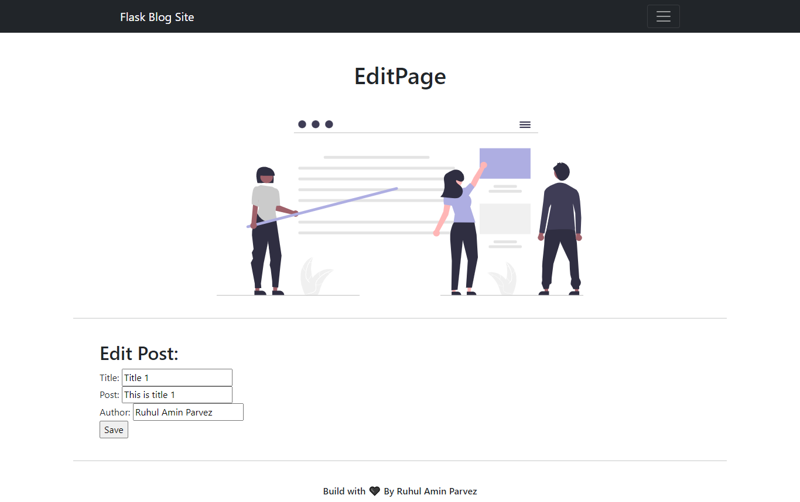
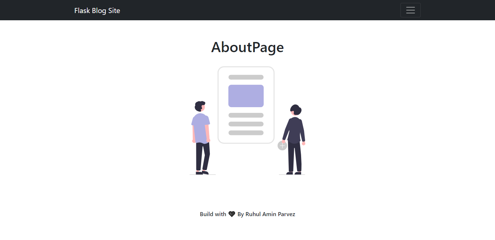

# Flask 🌶
Flask is a micro web framework written in Python. It is classified as a microframework because it does not require particular tools or libraries. It has no database abstraction layer, form validation, or any other components where pre-existing third-party libraries provide common functions. This repo I will store my Flask Codes.

 

## Deploy
👉 [Click Here for Live Preview](https://blog-flask-ruhul.herokuapp.com/)

 

## Blog Flask App Screenshot 📸

#### HomePage

  

#### Blogs

  

#### Add New

  

#### Edit Blogs

  

#### AboutPage

  

